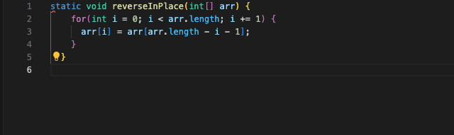
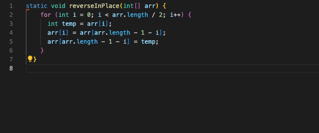

# Failure-Inducing Input
## JUnit test for failure-inducing input:
 import static org.junit.Assert.*;
import org.junit.*;

public class ArrayTests {
  @Test
  public void testReverseInPlaceFailureInducing() {
    int[] input = {1, 2, 3, 4};
    ArrayExamples.reverseInPlace(input);
    // Expected output: {4, 3, 2, 1}
    // The buggy implementation will produce an incorrect output
    assertArrayEquals(new int[]{4, 3, 2, 1}, input);
  }
}
# Failure - NON Inducing Input
## JUnit test for the non-failure-inducing input:

import static org.junit.Assert.*;
import org.junit.*;

public class ArrayTests {
  @Test
  public void testReverseInPlaceNonFailureInducing() {
    int[] input = {3};
    ArrayExamples.reverseInPlace(input);
    // Expected output: {3}
    // The buggy implementation will produce: {3}
    assertArrayEquals(new int[]{3}, input);
  }
}
# Symptom
Below is a screenshot of the output of running the two tests. One test should pass (the non-failure-inducing input), and the other test should fail (the failure-inducing input).

The Bug

Before code change:

After code change:

The fix addresses the issue by correctly swapping the elements in the array. The original implementation incorrectly overwrote elements before they could be swapped, leading to incorrect results. The corrected implementation only iterates through half of the array, using a temporary variable to swap the corresponding elements from the start and end of the array, ensuring that all elements are correctly reversed without overwriting.

# Part 2 - Researching Commands

1. Finding Files by Name
The -name option allows the programmer to search for files by their name.

Example 1:

sh
Copy code
find ./technical -name "example.txt"
Output:

bash
Copy code
./technical/documents/example.txt
This command searches for a file named example.txt within the ./technical directory and its subdirectories. It's useful for locating specific files.

Example 2:

sh
Copy code
find ./technical -name "*.md"
Output:

bash
Copy code
./technical/docs/readme.md
./technical/docs/notes.md
This command searches for all of the Markdown files (*.md) within the ./technical directory. It's useful for finding all files of a particular type.

2. Find Files by Type
The -type option allows you to search for files (f) or directories (d).

Example 1:

sh
Copy code
find ./technical -type f
Output:

bash
Copy code
./technical/docs/readme.md
./technical/images/logo.png
./technical/scripts/install.sh
This command lists all files within the ./technical directory. It's useful for generating a list of all files in a directory hierarchy.

Example 2:

sh
Copy code
find ./technical -type d
Output:

bash
Copy code
./technical/docs
./technical/images
./technical/scripts
This command lists all directories within the ./technical directory. It's useful for generating a list of all directories.

3. Find Files by Size
The -size option allows you to search for files based on their size.

Example 1:

sh
Copy code
find ./technical -size +1M
Output:

bash
Copy code
./technical/videos/tutorial.mp4
This command searches for files larger than 1 megabyte within the ./technical directory. It's useful for identifying large files.

Example 2:

sh
Copy code
find ./technical -size -100k
Output:

bash
Copy code
./technical/docs/readme.md
./technical/scripts/install.sh
This command searches for files smaller than 100 kilobytes within the ./technical directory. It's useful for finding small files.

4. Find Files by Modification Time
The -mtime option allows you to search for files based on their modification time.

Example 1:

sh
Copy code
find ./technical -mtime -7
Output:

bash
Copy code
./technical/reports/weekly_report.txt
This command searches for files modified within the last 7 days within the ./technical directory. It's useful for finding recently modified files.

Example 2:

sh
Copy code
find ./technical -mtime +100
Output:

bash
Copy code
./technical/archives/old_data.csv

This command searches for files modified more than 100 days ago within the ./technical directory. It's extremely useful for identifying old files that may need deleted.

sources:  https://unix.stackexchange.com/questions/179238/grep-inside-less

